

  <a href="#">
    
    <h2 align="center">Sabzlearn | سبزلرن</h2>
  </a>

# Screen SHOTS

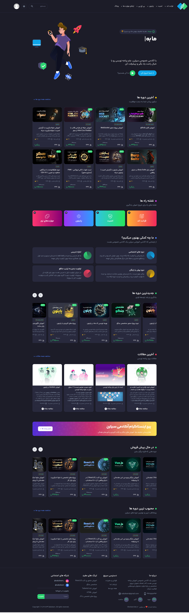
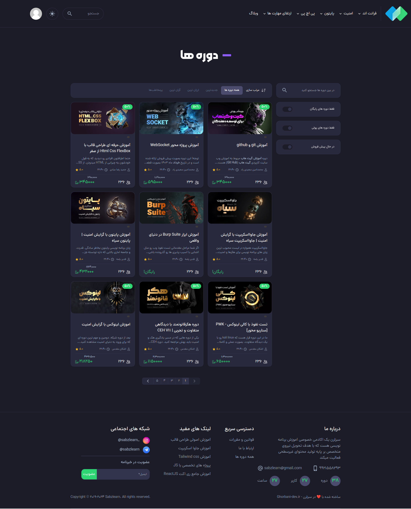
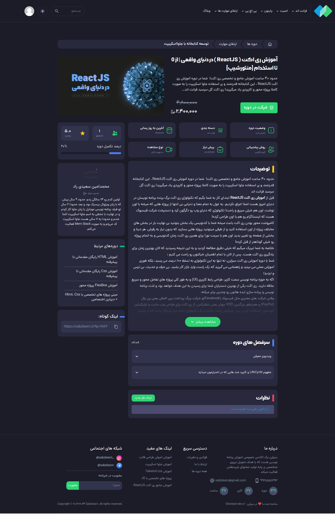
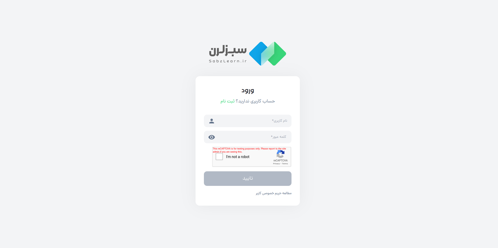
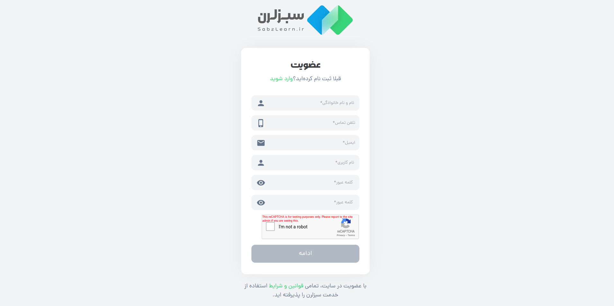
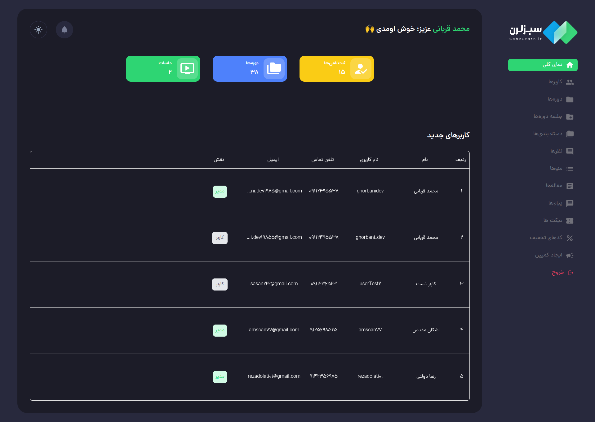
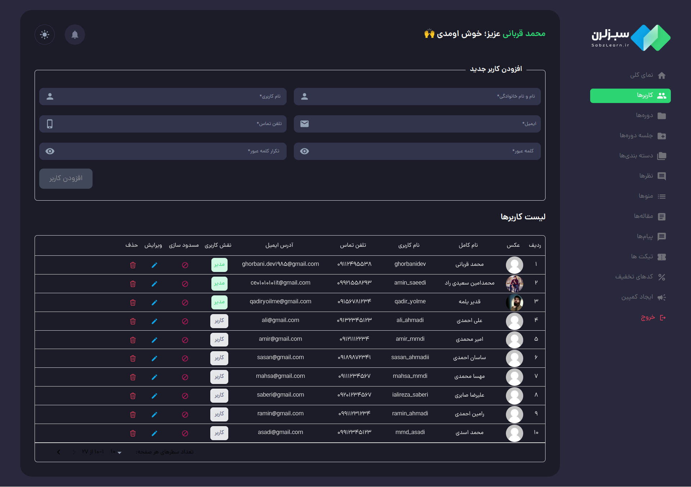
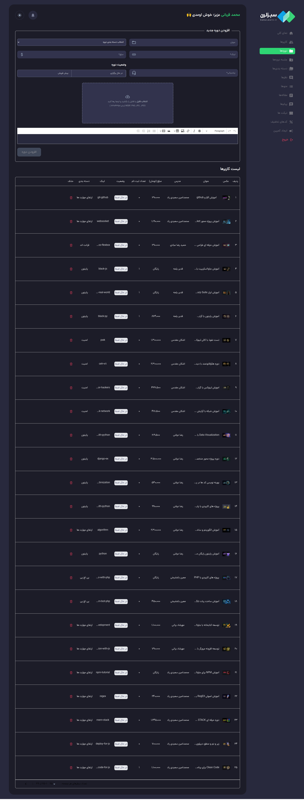
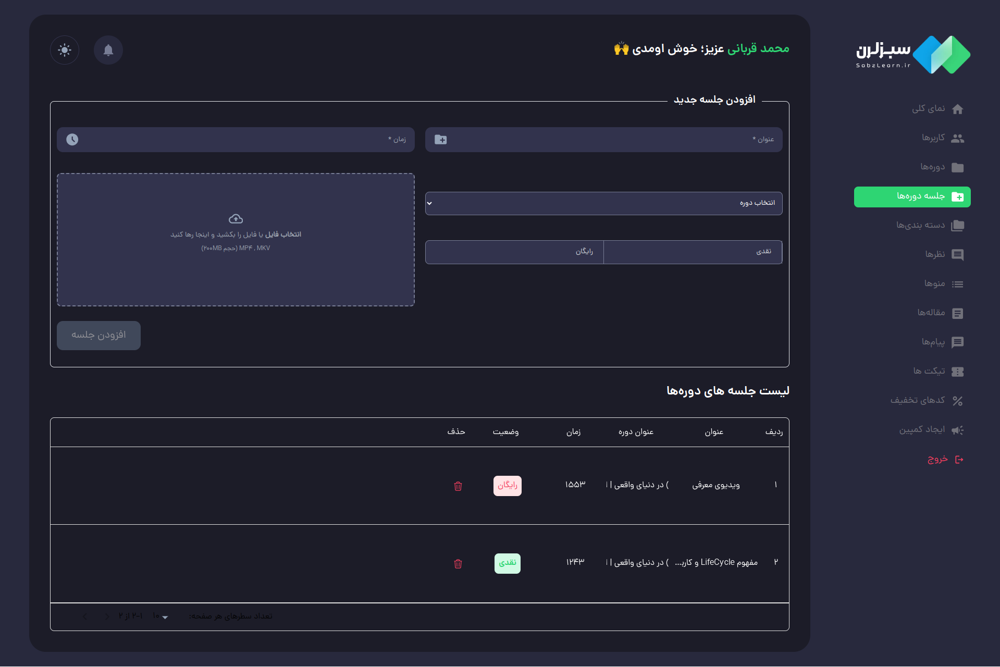
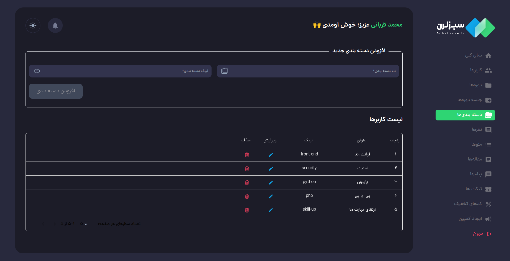
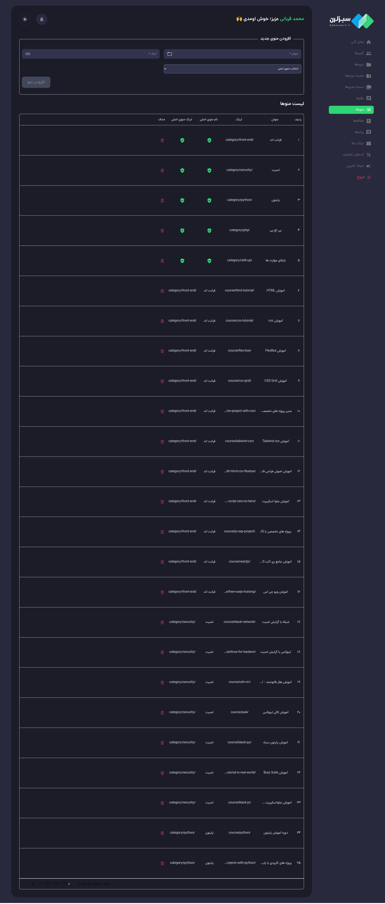
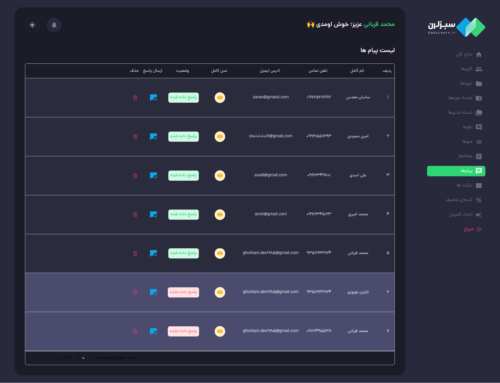

---

Fullstack app with NodeJS, MongoDB, ReactJS, TailwindCss, Mui

# APP Features

<ul>
<li>Courses Shop with AdminDashboard</li>
<li>Add and delete course</li>
<li>Add and delete course category</li>
<li>Add and delete menus and submenus</li>
<li>Add and delete blog</li>
<li>Add blog in draft</li>
<li>User can register and login</li>
<li>Full user profile</li>
<li>User can register to app newsletter</li>
<li>User can send ticket and show in Admin</li>
<li>Add and delete session of course</li>
<li>Add users in admin dashboard</li>
<li>Admin dashboard protect with user token</li>
<li>User can send comment for courses and show in admin</li>
<li>User show courses details</li>
<li>User can buy courses</li>
<li>Add discount for all courses in admin</li>
<li>Holding campaigns in admin dashboard for all courses </li>
<li>...</li>
</ul>

---

# APP Link

[sabzlearn.ghorbani-dev.ir](https://sabzlearn.ghorbani-dev.ir/)

---
# ADMIN DASHBOARD Link
[sabzlearn.ghorbani-dev.ir/adminDashboard/overview](https://sabzlearn.ghorbani-dev.ir/adminDashboard/overview)

Username: ghorbanidev
 
Password: ghorbaniDev@1

---

Made with :heart: by Ghorbani-Dev1985